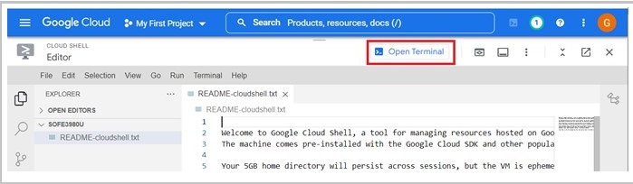

# Milestone 1: Data Ingestion System (Cloud Pub/Sub)

## Repository: 
https://github.com/zubxxr/SOFE4630U-MS1

## Table of Contents
- [Objectives](#objectives)
- [What’s Cloud Pub/Sub?](#whats-cloud-pubsub)
- [Creating GCP account](#creating-gcp-account)
- [Cloud Pub/Sub](#cloud-pubsub)
- [1. Create a Topic](#1-create-a-topic)
- [2. Create an Account Service Key](#2-create-an-account-service-key)
- [3. Create a Producer (Publisher) Using a Python Script](#3-create-a-producer-publisher-using-a-python-script)
- [4. Create a Consumer (Subscriber) Using a Python Script](#4-create-a-consumer-subscriber-using-a-python-script)
- [5. Simulating a Real Meter](#5-simulating-a-real-meter)
- [Discussion](#discussion)
- [Design](#design)
- [Deliverables](#deliverables)
  
## Objectives
1.	Understand the role of the Data Ingestion System in Event Driven Architecture.
2.	Get familiar with Google Pub/Sub and its terminologies.
3.	Be able to create topics, producers, and consumers via GUI.
4.	Create producers and consumers with a Python script.


## What’s Cloud Pub/Sub?
1.	Watch the following video about [Event Driven Architecture (EDA)](https://www.youtube.com/watch?v=o2HJCGcYwoU)
2.	The core component of an EDA is the Data Ingestion System, also known as Publisher/Subscriber (Pub/Sup). Kafka is one of the most frequently used pub/sub. Google Cloud Platform (GCP) has a data ingestion service called Cloud Pub/Sub. Watch the following video to understand [the Cloud Pub/Sub and its terminologies](https://www.youtube.com/watch?v=MjEam95VLiI).

You will start by creating a GCP account. Then, you will learn how to configure topics in a Cloud Pub/Sub and Publish and consume data through the topics.

## Creating GCP account
1. Creating a new Gmail account is recommended, but you can use an existing one if it still allows you a free trial.
2. Go to the [GCP official site](https://cloud.google.com/gcp). Be sure that you are using the correct account. Then, click on **Get Started for Free** button
   
   
4. Fill the account information and accept the terms of services.
   
   
5. In the next step, you will fill in your personal information and a credit card information. That information is to ensure that you are a real person. This will create a free account for 90 days and give you 300+ $ free credits. **No charges are made unless you upgrade to a paid Cloud Billing account**. Please read [the GCP billing verification](https://cloud.google.com/free/docs/free-cloud-features#billing_verification) for more information.
   
   
6. Fill in the final survey. Then, click **Done**. You can safely skip any given offers.
   
     
7. Get yourself familiar with
* Dashboard: allows you to search and select available cloud services
* project(s): a project usually named **My First Project** will be created, However, you can create, edit, and delete projects.
* The console: By clicking the console icon, the console will be opened to you. The console is a Linux terminal that can be used to configure the cloud. Any commands affecting the console's local OS will be temporary and lost whenever the session is closed, while any change made to cloud services will be permanent.
  
   
   The console will be opened at the bottom of the page as shown in the following figure and from it we can exchange files and folders with your local computer by downloading or uploading them. You can also click **Open Editor** button to open a text editor.
    
   
* Editor: It’s a text editor that allows you to edit plain text file as shown in the following figure. You can switch back to the console by clicking **Open Terminal** button.
  
   
# Cloud Pub/Sub

In this section, you will learn to create topics in Pub/Sun. Also, you will write and run Python Script to publish into and consume messages from the topic.

## 1. Create a Topic
1.	Search for **Pub/Sub**.  

        
2.	Click the **CREATE TOPIC** button.

        
3.	Set the topic ID to **testTopic**. Leave the default options. Then, click **CREATE**. **Note**: A default subscription will be automatically created.

        
4.	The topic will be created. The default subscription is created under the name **testTopic-sub**. 
   
        
## 2. Create an Account Service Key

A service account is a special account typically used by an application. This subsection will create a service account with the Pub/Sub Publisher and Subscriber roles. A key for this service account is needed to grant access to the Pub/Sub service from your machine.

1.	Search for **Service accounts**.
   
        
2.	Click **CREATE SERVICE ACCOUNT** button.

        
3. Set the service account name to **pubsub-system**. Then, click the **CREATE AND CONTINUE** button.
   
        
4. Add two roles to the service account, **Pub/Sub Publisher** and **Pub/Sub Subscriber**

          
5.	Don't grant users’ access. Leave the textboxes blank and click Done.

        
6.	The service account will be created. Click on it to create and download a key to use the service account.

        
7. Go to the **keys** tab, Choose **ADD KEY**, and Select **Create new key**.

        
8. Choose **JSON** as the key type. Finally, click the **CREATE** button to create and download the key to your machine.
  
## 3. Create a Producer (Publisher) Using a Python Script

In this section, a publisher will be created using a Python script to publish messages through the pre-created topic. This code should run on your local machine, but you can also run it on the cloud console. However, this is not recommended. 

1.	Download the files from the folder **v1** from the GitHub repository to a specific folder on your computer.  
2.	Copy the JSON file containing the key to the service account obtained in the previous section to the same folder.
3.	The script containing the producer script is **producer.py**, as shown in the following figure. The publisher produces messages to the **testTopic** topic.
   
         
4. Let's go through the code:
      * Lines 1-4: importing the needed libraries
      * Lines 8-9: search the current directory for JSON files and set the first file found to the environment variable **GOOGLE_APPLICATION_CREDENTIALS**. The **google.cloud** library will access this environment variable to grant access to the Pub/Sub.
      * Lines 12-13: define the project and topic names. **Note**: you will set the project name in line 12 before running the script.
      * Lines 16-18: create a publisher for the topic and set the full topic path.
      * lines 21-36: a loop that will iterate 100 times to publish messages to the topic
      * Lines 23-27: read the message and stop the loop for a blank input.
      * line 29: convert the message to bytes. This is called serialization. It's needed before sending the message to the topic.
      * Lines 32-33: send the serialized message into the topic.
      * Line 36: ensure that the publishing has been completed successfully. It will throw an exception if a time-out occurs before receiving an acknowledgment.

5. Get the project ID from the GCP console, as shown in the following figure, and type it in the 12th line. You can change the topic name in line 13 if needed to match the open you have already created.
   
        
6. Install the **google.cloud** library by running the following command in the **Command Prompt** window.
      ```shell
      pip install google-cloud-pubsub
      ```
7.	Run the **producer.py** script. Enter some strings to be published.
8.	Check that the messages have been sent to the topic by navigating to the **testTopic-sub** subscription. Select the **MESSAGES** tab and press the **pull** button

        

## 4. Create a Consumer (Subscriber) Using a Python Script

The subsection will create a consumer that will create a subscriber to consume messages from the **testTopic** topic. The publisher created in the previous subsection will be used to produce messages that will be received by the consumer, as shown in the following figure.

  

1. The folder used in the previous subsection contains another Python script file, **consumer.py**.
   
        
2. Let's go through the code:
      * Lines 1-4: importing the needed libraries
      * Lines 8-9: search the current directory for JSON files and set the first file found to the environment variable **GOOGLE_APPLICATION_CREDENTIALS**. The **google.cloud** library will access this environment variable to grant access to the Pub/Sub.
      * Lines 12-15: define the project and topic names as well as the subscription ID. **Note**: you will set the project name in line 12 before running the script.
      * Lines 17-19: create a subscriber from the topic and set the full topic path.
      * lines 33-40: subscribe to the topic and set a callback function to be called automatically for each message received. 
      * Lines 24-31: the callback function will automatically be called for any received message.
      * line 26: convert the message from bytes to string, the format of the publisher's messages. This is called deserialization.
      * Lines 31: acknowledge the Pub/Sub that the message has been received and processed.
3.	Type the project ID into the GCP console in the 12th line. You can change the topic name and the subscription ID in lines 13 and 14 if needed to match the open you have already created.
4.	The JSON file containing the key to the service account already exists in the folder during the previous subsection. Thus, it will also be accessed by the consumer because both the consumer and the producer are in the same folder.
5. Run the **producer.py** script.
6. Run the **consumer.py** script.
7. Enter messages to be published by the producer and observe them received by the consumer.
   
## 5. Simulating a Real Meter. 

  

1.	Copy the files from the **v2** folder from the GitHub repository.
2.	Create a new topic and name it **smartMeter**
3. Copy the JSON file containing the key for the account service to the **v2** folder.
4.	Set the project ID in the **consumer.py** script as you did before. The script creates a consumer that reads from the **smartMeter** topic. Execute the script and leave it running so that you can consume the messages once they produced for the topic. The only difference is that the message get decoded (deserialized) by the **json.loads()** function as the producer will send them as a dictionary (JSON-like format) instead of string.
5.	Set the project ID in the **smartMeter.py** script. It will simulate a smart meter by randomly generating measurements and publishing them into the topic.  The code looks like the producer used before, except
    * Lines 24-29: define the random distribution parameters used to generate messages.
    * Lines 32-61: iteratively generate random measurements, serialize them, and publish them to the topic.
6. run the **smartMeter.py** script and notice both the consumer and the producer.

## Discussion
* What is EDA? What are its advantages and disadvantages?
* Cloud Pub/Sub has two types of subscriptions: push and pull. Describe them, showing the strengths and weaknesses of each based on potential applications.
* When publishing a message into a topic, an ordering key can be specified. Using examples, describe the role and benefits of ordering keys.

## Design
Download the Labels.csv file from the Design folder in the repository. Write two Python scripts to produce and consume the records read from the CSV file. Create a new topic and assign it a name that suits the purpose of the tasks below.

#### The Producer:

1. Read the CSV file.
2. Iterate over the records in the CSV file:
   - Convert each record (row from the CSV file) into a dictionary.
   - Serialize the dictionary into a message.
   - Publish the message to your topic.

#### The Consumer:
1. Receive messages from the topic.
2. Process each message:
   - Deserialize the message into a dictionary.
   - Print the values of the dictionary.

## Deliverables
1. A GitHub link to the scripts used in the Design part.
2. A report that includes the discussion and the design parts.
3. An audible video of about 3 minutes showing the smart meter application. 
4. Another audible video of about 5 minutes showing the design part. 

Put the GitHub link and video links inside your report, and submit the report.
